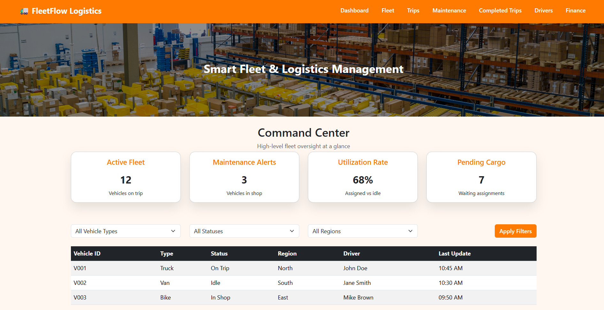
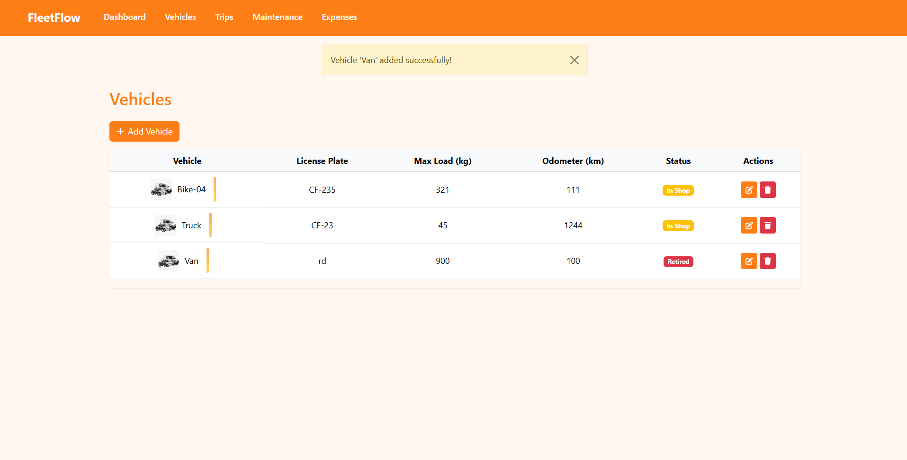
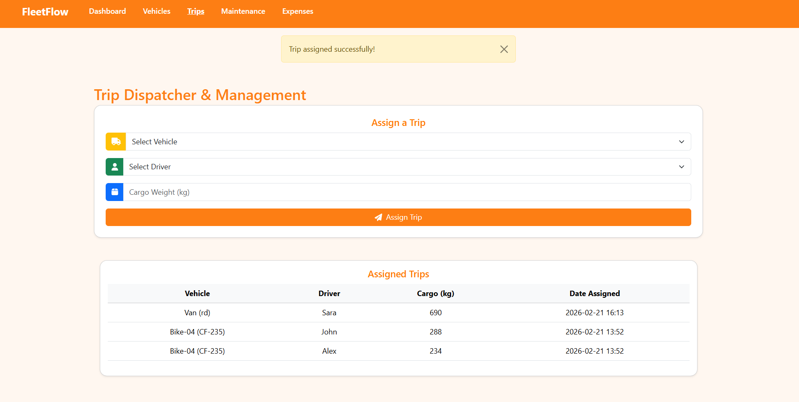
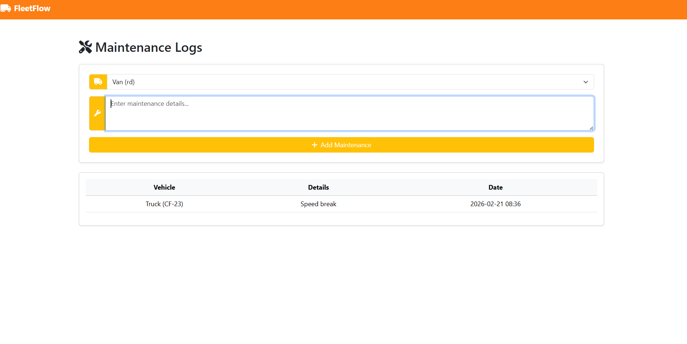
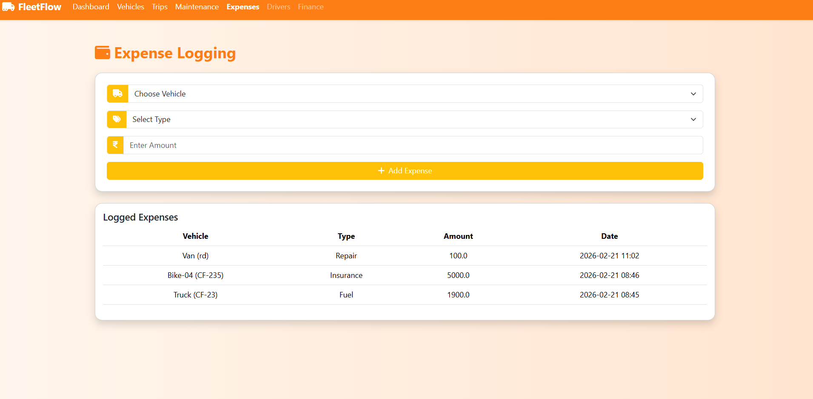
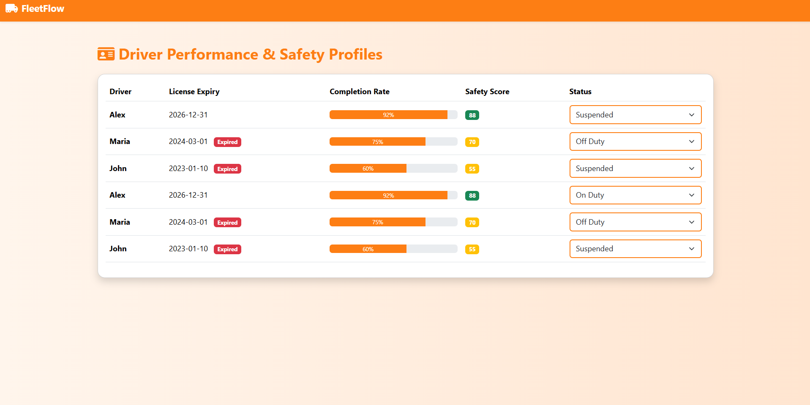
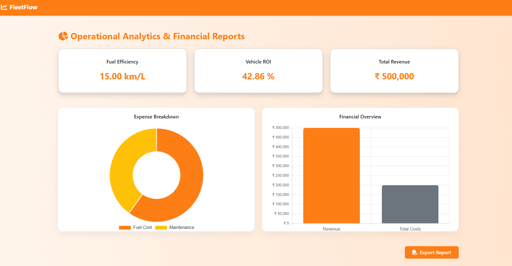

# 🚛 FleetFlow - Smart Fleet Management System

**FleetFlow** is a Flask-based web application designed to help organizations efficiently manage vehicles, drivers, trips, maintenance, and operational expenses from a single centralized platform.

It replaces manual logbooks and spreadsheets with a structured digital system that improves tracking, reduces operational delays, and provides actionable insights through analytics dashboards.

---

## 🎯 Problem Statement

Many fleet operations are still managed manually using spreadsheets, paperwork, or disconnected tools. This leads to:

- Poor vehicle tracking  
- Missed maintenance schedules  
- Inefficient trip planning  
- Lack of financial visibility  
- Difficulty monitoring driver performance  

FleetFlow solves these challenges by providing a centralized web-based platform to manage and monitor all fleet activities in real time.

---

## 💡 Solution

FleetFlow provides a role-based fleet management system that enables managers and dispatchers to:

- Track vehicles and drivers  
- Assign and monitor trips  
- Log maintenance activities  
- Record operational expenses  
- View analytics and performance insights  

This improves operational efficiency, reduces downtime, and supports better decision-making.

---

## ✨ Features

- 🚗 **Vehicle Management** – Add, update, and monitor vehicle details  
- 🛣️ **Trip Management** – Assign trips to vehicles and drivers  
- 🛠️ **Maintenance Logging** – Track servicing and repairs  
- 💰 **Expense Tracking** – Record operational costs per vehicle  
- 👨‍✈️ **Driver Management** – Monitor driver status and assignments  
- 📊 **Operational Analytics** – Visual dashboard with key insights  
- 🔐 **Role-Based Access** – Manager and Dispatcher permissions  

---

## 👥 User Roles

### 👨‍💼 Manager
- View analytics dashboard  
- Manage vehicles and drivers  
- Monitor expenses  
- Track maintenance history  

### 🚚 Dispatcher
- Assign trips  
- Update trip status  
- Monitor driver availability  
- Record operational updates  

---

## 🖼️ Screenshots

### 🔑 Login

### 📊 Dashboard

### 🚗 Vehicles

### 🛣️ Trips

### 🛠️ Maintenance

### 💰 Expenses

### 👨‍✈️ Drivers

### 📊 Operational Analytics

---

## 🧰 Tech Stack

- **Backend:** Flask (Python)  
- **Frontend:** HTML, CSS, JavaScript 
- **Database:** SQLite  
- **ORM:** Flask-SQLAlchemy  
- **Authentication:** Flask-Login  
- **Templating:** Jinja2  

---

## 📊 Key Benefits

✔ Centralized fleet data management  
✔ Reduced manual errors  
✔ Improved maintenance tracking  
✔ Better financial visibility  
✔ Data-driven decision making  

---

## 🚀 Future Enhancements

- GPS tracking integration  
- AI-based maintenance prediction  
- Real-time alerts and notifications  
- Cloud deployment  
- Mobile application support  
- Fuel consumption analytics  

---

## 🎥 Demo Video

https://drive.google.com/file/d/1BY57J8cblNXr56wOnTeDrGAKJFmQhbBe/view?usp=drivesdk

## 🛠️ Installation

### 1️⃣ Clone the repository

git clone https://github.com/Ramela-M-S/fleetflow.git
cd fleetflow

### 2️⃣ Create virtual environment

python -m venv venv

### 3️⃣ Activate virtual environment

**Windows**

venv\Scripts\activate

**Mac / Linux**

source venv/bin/activate

### 4️⃣ Install dependencies

pip install -r requirements.txt

### 5️⃣ Run the application

python run.py

### 6️⃣ Open in browser

http://127.0.0.1:5000
